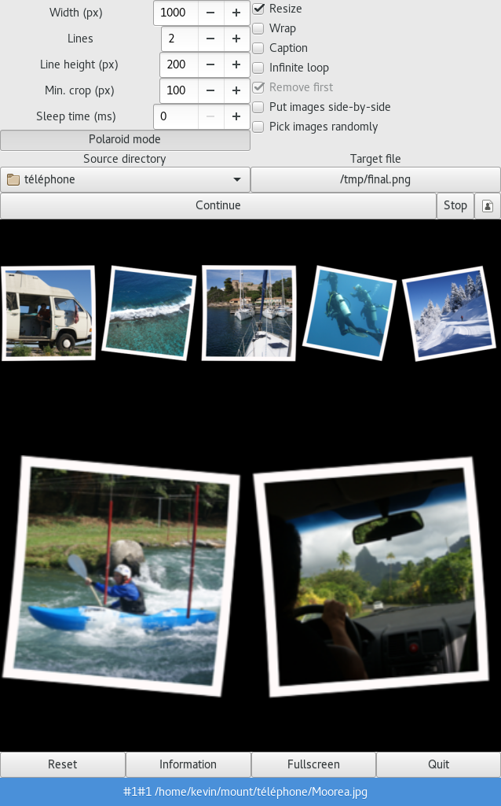

Photowall generator
===================

This is a Python photowall generator, relying on ImageMagick.

Usage: 
------
       photowall.py <path> <target> [options]

     Arguments:
       <path>        The path where photos are picked up from. [default: /home/kevin/mount/téléphone]
       <target>      The path where the target photo is written. Except in POLAROID+RANDOM mode, the image will be blanked out first. [default: /tmp/final.png]

     Options:
       --polaroid              Use polaroid-like images for the wall
       --pick-random           Pick images randomly in the <path> folder. [default: False]
       --help                  Display this message

     Size options:
       --nb-lines <nb>         Number on lines of the target image. [default: 2]
       --line-height <height>  Set the height of a single image. [default: 200]
       --width <width>         Set final image width. [default: 1000]
       --no-resize             Resize images before putting in the wall. [default: False]

     Polaroid mode options:
       --crop-size <crop>      Minimum size to allow cropping an image, if it doesn't fit [default: 100]
       --no-caption            Disable caption. [default: True] 
       --put-random            Put images randomly instead of linearily. [default: False]
       --sleep <time>          If --put-random, time (in seconds) to go asleep before adding a new image. [default: 0]

     Collage mode options:
       --do-wrap               Finish images on the next line? [default: False]

Examples
--------

**Polaroid mode with caption**

    --polaroid  --nb-lines 1 --pick-random

**Polaroid mode with no caption**

    --polaroid --no-caption --nb-lines 1 --pick-random

**Collage mode**

    --nb-lines 1 --pick-random

**Polaroid random mode**

    --put-random --nb-lines 1 --pick-random

Graphical interface
-------------------

I built a graphical interface that should support all the command-line arguments:

